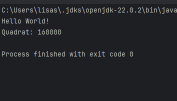

# HelloWorld

## Author
Lisa Schloffer

LBS Eibiswald | 2aAPC | 11.09.2024

## Wichtige GitHub Funktionen erklärt:

commit: Speichert Änderungen im lokalen Git-Repository mit einer Nachricht zur Beschreibung.

branch: Erstellt eine neue Entwicklungszweig oder zeigt existierende an.

merge: Fügt die Änderungen eines Branches in einen anderen zusammen.

checkout/switch: Wechselt zwischen verschiedenen Branches oder Revisionen im Repository.

rebase: Ändert den Basis-Commit eines Branches.

cherry-pick: Wendet einen spezifischen Commit von einem anderen Branch auf den aktuellen an.

reset: Mit reset lassen sich auf einfache Weise Änderungen rückgängig machen, die noch nicht mit anderen geteilt wurden.

push: Überträgt lokale Commits zum Remote-Repository.

pull: Holt Änderungen aus dem Remote-Repository und integriert sie im lokalen Repository.

origin: Standardbezeichnung für das standardmäßige Remote-Repository, von dem aus geclont oder zu dem gepusht wird.

## Installation
git checkout origin/master 

( [Back to top](#top) )

## Verwendung
- Java

// some source code configuration

( [Back to top](#top) )

## Screenshot

( [Back to top](#top) )

## License
This project is licensed under the [MIT License](https://opensource.org/licenses/MIT) 

( [Back to top](#top) )
